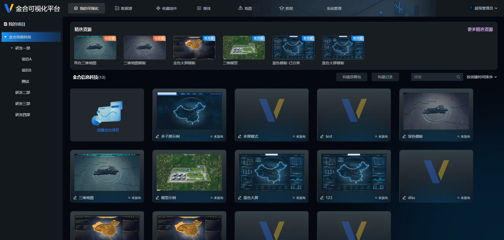
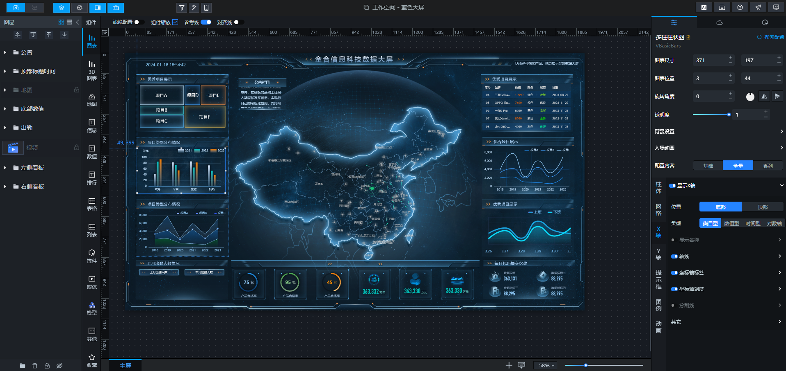

<!--
 * @Author       : wfl
 * @LastEditors  : wfl
 * @description  :
 * @updateInfo   :
 * @Date         : 2023-10-31 11:12:39
 * @LastEditTime : 2024-01-31 10:22:28
-->

  

  <h3>金合可视化平台</h3>

  <a href="http://www.ikingtech.com/">官网</a>
  |
  <a href="https://datavdoc.ikingtech.com">文档</a>
  |
  <a href="https://datav.ikingtech.com">在线演示</a>
  |
  <a href="https://gitee.com/ikingtech/iking-datav-server">Node服务端</a>
  |
  <a href="https://gitee.com/ikingtech/iking-datav/issues">提交Bug</a>

  演示环境账号：iking 密码：iking.com

## 简介
金合可视化平台是一个通过拖拽配置生成可视化大屏的低代码平台。它包含项目管理、应用管理、数据源管理、过滤器管理、收藏、模板市场、应用独立部署等功能。平台提供了丰富的图表组件、地图组件、媒体组件、动画组件和常用的大屏页面组件，支持加载三维模型，支持事件配置。用户可以通过简单的鼠标拖拽组件放入页面容器，配置组件样式，组件数据。即可完成一个大屏页面的开发。

平台包含3个部分:
- **金合可视化平台 **
- **金合可视化平台Midwayjs服务端 **
- **金合可视化平台后台管理平台(暂未开源) **

## 技术栈
* 💪 Vue 3.0+
* ⚡ Vite 3.0+
* 🍍 Pinia 2.0+
* 🔥 TypeScript 4.0+
* 🔥 ECharts 5.0+
* 🔥 mars3d 3.6+
* 🔥 Threejs 0.159.0

### 平台截图

### 

### 说明
可视化平台前端基于[pengxiaotian](https://gitee.com/pengxiaotian/datav-vue)开源框架，在框架基础上扩展了功能，添加了后台管理和服务端。
